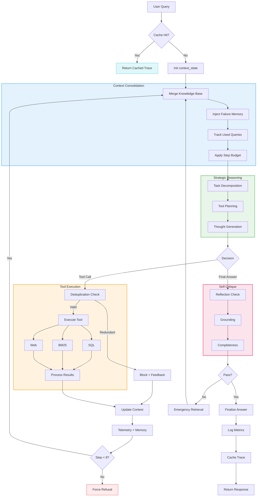

# Design Document: Movie Reasoning Agentic RAG

## 1. Overview
The Movie Reasoning Agent is a multi-step "Thinking" RAG system designed to answer complex queries across structured, unstructured, and real-time data. Unlike standard single-shot RAG, this system follows a **ReAct (Reasoning + Acting)** architecture, allowing it to plan, retrieve, and refine its search based on intermediate discovery.

---

## 2. Agent Architecture
The core engine is a hand-coded loop that manages state transitions between the LLM and the integrated tools.

---

## 3. The Step-by-Step Reasoning Loop

### **Step 1: Input & Cache Analysis**
The agent first checks a persistent JSON cache. If a trace exists for the question, it re-renders the previous reasoning process instantly, saving cost and time.

### **Step 2: Strategic Planning (Internal Cycle)**
Before interacting with any tool, the agent follows a mandatory internal protocol:
1.  **Strategic Breakdown**: Decomposes the user's query into logical sub-tasks.
2.  **Plan**: Writes a 1-3 sentence justification for the next move.
3.  **Thought**: Simulates internal logic to ensure consistency.

### **Step 3: Action Execution & Context Injection**
For every turn, the agent is fed a **Knowledge Consolidation Layer**:
- Current structured facts (already found in SQL).
- Review snippets (already found in Docs).
- Historical failures (e.g., specific SQL queries that errored).
- Step budget remaining.

### **Step 4: Self-Critique & Finalization (Bonus C)**
Once an answer is formed, the agent runs an internal "Audit Turn" where it checks:
- "Does this actually answer the question?"
- "Is every claim cited?"
If the audit identifies a gap, the agent triggers **one emergency retrieval round** to fix the omission before the user sees the output.

### **Step 0: Proactive Safety Gating**
To ensure safe operations, the system implements a **Pre-Processing Guard**. Before any LLM turn or tool call, the query is scanned for adversarial patterns (e.g., prompt injection or instructions to ignore system guidelines). If detected, the system issues an immediate **0-step refusal**, bypassing the reasoning engine entirely to protect internal system prompts.

---

## 4. Tool Schema Registry

| Tool Name | Description | Key Inputs | Expected Output |
|:---|:---|:---|:---|
| **`search_docs`** | Semantic BM25 search over unstructured movie reviews. | `query` (Natural Language) | Top-3 snippets with source Filename/Page. |
| **`query_data`** | Read-only SQL access to structured movie metadata. | `sql_query` (SQLite string) | Markdown table with worldwide gross, budget, etc. |
| **`web_search`** | Real-time news/awards retrieval via Tavily. | `query` (Fact-finding string) | URL-cited snippets for fringe data. |

---

## 5. Loop Prevention & Safety Engineering

To ensure the agent never enters an infinite loop or consumes excessive tokens, three distinct "Brakes" are implemented:

1.  **Hard Step Cap**: A physical `step_count < 8` check is enforced at the top of the `while` loop. If the count exceeds 8, the system terminates with a "Budget Exceeded" refusal.
2.  **Semantic Keyword Deduplication**: 
    - Queries are tokenized and normalized (removing stop words like "the", "a", "info").
    - If the LLM tries to call a tool with keywords it has **already used successfully**, the system returns a `Redundant Call` error.
3.  **Error Memory**: If a SQL query fails (e.g., bad join or column name), the specific failed query is stored in `failed_sql_queries` and fed back into the next turn as a warning to prevents the LLM from repeating the same broken query.

4.  **The Deduplication Wall**: 
    A modular utility that prevents the agent from entering "Loop Traps". By tokenizing and normalizing each tool query, the system identifies semantically redundant calls. This forces the agent to use its existing knowledge base instead of wasting steps on repeated data retrieval, essentially acting as an efficiency governor.
