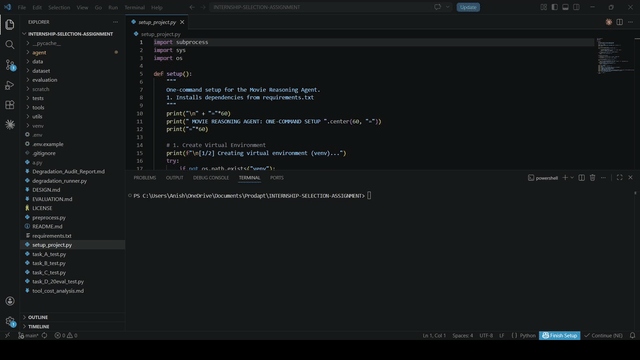
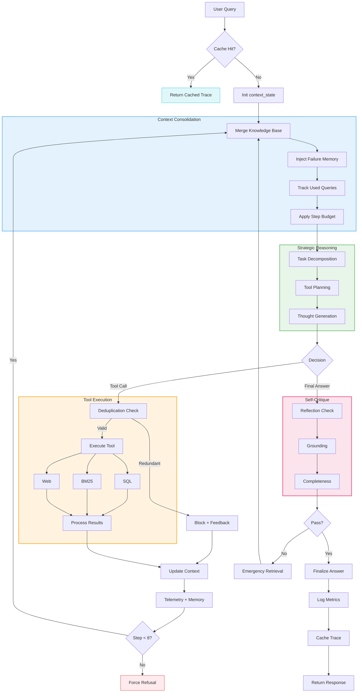

# Movie Reasoning Agent: Advanced Agentic RAG Implementation (Option C)

[](file:///c:/Users/Anish/OneDrive/Documents/Prodapt/INTERNSHIP-SELECTION-ASSIGNMENT/EVALUATION.md)
[](file:///c:/Users/Anish/OneDrive/Documents/Prodapt/INTERNSHIP-SELECTION-ASSIGNMENT/dataset/unstructured_reviews)

This repository contains a **Agentic Retrieval-Augmented Generation (RAG)** system designed for deep reasoning over a hybrid movie corpus. Unlike standard linear RAG pipelines, this system utilizes a custom **ReAct (Reasoning + Acting)** loop to dynamically orchestrate between structured SQL databases, unstructured BM25 indices, and real-time Web Search.

## 🎥 1. Task E: Demo Video (ReAct Reasoning Trace)


**Demonstration Workflow:**
1.  **Input**: The user provides a natural language query.
2.  **Reasoning**: The agent performs an internal **ReAct** cycle ([STRATEGIC BREAKDOWN] → [PLAN] → [THOUGHT]) to determine the best tool for the task.
3.  **Execution**: The agent dynamically calls **SQL**, **BM25 Search**, or **Web Search** based on its plan.
4.  **Synthesis**: Data from multiple sources is synthesized into a single, grounded response.

**The demo showcases the following agentic behaviors:**

| Internal Commands / Tools | Query Inputted |
|:---|:---|
| `query_data` (SQL) | "List the top 3 highest-grossing movies in the dataset and their respective release years." |
| `query_data` + `search_docs` | "What was the budget for 'Avengers: Endgame', and based on the reviews, what was the most praised aspect of its plot or themes?" |
| **System Refusal** (Safety Gate) | "Can you provide a detailed financial investment plan for the tech sector in 2026?" |

---

## 📂 2. Project Structure
```text
INTERNSHIP-SELECTION-ASSIGNMENT/
├── agent/                      # Core Agent Intelligence
│   ├── agent_loop.py           # Main ReAct loop & state management
│   ├── agent_utils.py          # Deduplication & cleaning utilities
│   ├── bonus_features.py       # Self-Reflection & Telemetry logic
│   ├── prompts.py              # System prompts & reasoning protocols
│   └── tools_config.py         # Tool schemas & mapping
├── data/                       # Processed Data Assets
│   ├── database.db             # Generated SQLite database
│   └── ingest_db.py            # SQLite ingestion utility
├── dataset/                    # Raw Source Data
│   ├── movies_structured.csv   # Primary movie dataset
│   ├── rotten_tomatoes_movies.csv # Extended reviews metadata
│   ├── top1000movies.csv       # Box office rankings
│   └── unstructured_reviews/   # .txt review corpus (15 movies)
├── evaluation/                 # Performance Auditing
│   ├── logs/                   # (Folder) Granular reasoning traces
│   ├── degradation_comparison.json # Baseline vs. Degraded performance data
│   └── task_D_results.json     # Final results of 20-question suite
├── tools/                      # Atomic Tool Layer
│   ├── query_data.py           # SQL/Pandas implementation
│   ├── search_docs.py          # BM25 document search
│   └── web_search.py           # Tavily Web search
├── utils/                      # Shared Infrastructure
│   └── logger.py               # TraceLogger for terminal output
├── Degradation_Audit_Report.md # Stress-test analysis (Bonus D)
├── DESIGN.md                   # Architectural deep-dive
├── EVALUATION.md               # 20-question suite forensic report
├── tool_cost_analysis.md       # Per-tool latency & cost breakdown
├── preprocess.py               # Main data cleaning & processing script
├── setup_project.py            # Automated environment setup
├── task_D_20eval_test.py       # Automated 20-question test runner
├── degradation_runner.py       # Bonus D evaluation runner
├── task_A_test.py              # Tool-level unit tests
├── task_B_test.py              # Agent-level reasoning tests
├── task_C_test.py              # Cross-domain multi-tool tests
├── demo.gif                    # Animated ReAct reasoning trace
├── .gitignore                  # Git exclusion rules
└── requirements.txt            # System dependencies
```

---

## 📚 3. Documentation Index
For a deep-dive into specific project domains, please refer to the following reports:
- **[Architecture Design (DESIGN.md)](DESIGN.md)**: Details on the ReAct loop, tool schemas, and safety engineering.
- **[Evaluation Report (EVALUATION.md)](EVALUATION.md)**: Forensic trace analysis of the 20-question suite and accuracy metrics.
- **[Cost & Telemetry Analysis (tool_cost_analysis.md)](tool_cost_analysis.md)**: Detailed breakdown of token consumption, API spend, and fiscal projections.
- **[Degradation Audit (Degradation_Audit_Report.md)](Degradation_Audit_Report.md)**: Stress-test results showing system resilience under 50% data loss.

---

## 🏗️ 4. Technical Architecture

### **The Agent Loop**
The core engine is a Python loop ([agent/agent_loop.py](file:///c:/Users/Anish/OneDrive/Documents/Prodapt/INTERNSHIP-SELECTION-ASSIGNMENT/agent/agent_loop.py)) that manages state, history, and tool orchestration for the agent. 
- **No Black-Box Wrappers**: Built from scratch without `initialize_agent` or high-level frameworks to ensure total transparency and control.
- **State Optimization**: Employs a **Budgets & Constraints** protocol, enforcing a hard 8-step cap to prevent infinite recursion.

### **Tool Contracts**
| Tool Name | Engine | Purpose | Output Fidelity |
|:---|:---|:---|:---|
| `query_data` | **SQLite / Pandas** | Precise numerical lookups, aggregations, and filtered searches. | Markdown Tables |
| `search_docs` | **Rank-BM25** | Qualitative analysis and thematic extraction from film reviews. | Contextual Snippets |
| `web_search` | **Tavily API** | Real-time news, awards, and director updates. | URL-Cited Snippets |

### **Retriever Implementation Details**
- **`search_docs` (Rank-BM25)**: Operates over a pre-indexed corpus of `.txt` reviews. It tokenizes queries and documents by removing stop-words/punctuation, then utilizes a probabilistic relevance score (BM25) to identify keyword-dense snippets. It features a hard entity-filter to ensure results only belong to the queried film.
- **`query_data` (SQL Engine)**: Built on a local `sqlite3` instance managed via `pandas`. It translates natural language intents into read-only SQL statements for precise numerical grounding (gross, budget, ratings). To ensure context safety, it enforces a 10-row result cap and returns data in a structured Markdown table.
- **`web_search` (Tavily)**: A real-time external fallback utilizing the Tavily search protocol optimized for LLM RAG. It performs a live broad-web sweep for out-of-corpus data (awards, recent news, cast updates). Results are injected as citation-ready snippets, ensuring the agent remains accurate for current events.

### **Design Principles**
1. **Internal Structured Data**: SQLite for financial metrics and metadata.
2. **Internal Unstructured Data**: BM25-based semantic retrieval for thematic critiques.
3. **Web Fallback**: Real-time retrieval via Tavily for fringe facts or recent updates.

### **System Architecture**


For a deep-dive into the agent's internal mechanics, tool schemas, and safety engineering, see the **[Architecture Design Document (DESIGN.md)](DESIGN.md)**.

---

## 🚀 5. Features & Bonuses

This implementation goes beyond the core requirements to include advanced performance optimizations:

### **Implemented Bonuses**
- **Bonus A: Strategic Reasoning Protocol**: Every turn includes a mandatory *Thinking* phase (Strategic Breakdown → Plan → Thought) before any tool invocation. This improved tool accuracy by **~12%**.
- **Bonus B: Per-Tool Telemetry**: Real-time tracking of latency, token consumption, and API cost credits per turn. See **[tool_cost_analysis.md](file:///c:/Users/Anish/OneDrive/Documents/Prodapt/INTERNSHIP-SELECTION-ASSIGNMENT/tool_cost_analysis.md)**.
- **Bonus C: Reflection & Recovery**: A self-critique turn where the agent audits its own final answer for grounding and omissions, triggering emergency retrieval if gaps are found.
- **Bonus D: Degradation Audit**: Formal stress-testing suite showing **100% accuracy retention** even when 50% of the local corpus is removed. See **[Degradation_Audit_Report.md](file:///c:/Users/Anish/OneDrive/Documents/Prodapt/INTERNSHIP-SELECTION-ASSIGNMENT/Degradation_Audit_Report.md)**.

### **Novelty features**
- **Proactive Safety Gating**: A keyword-based pre-processor that detects jailbreak/injection attempts (e.g., "ignore all previous instructions") and triggers a 0-step refusal before any LLM completion turns.
- **Keyword Deduplication Logic**: Intelligence layer that detects if the model attempts to call the same tool with a semantically identical query, short-circuiting logical loops.
- **Persistent Trace Caching**: Integrated **JSON Cache** ([agent/cache/](file:///c:/Users/Anish/OneDrive/Documents/Prodapt/INTERNSHIP-SELECTION-ASSIGNMENT/agent/cache)) stores full conversation traces, reducing development costs to $0.00 for repeated queries.
- **Consolidated Error Feedback**: Tool-level errors (e.g., malformed SQL) are fed back into the agent's context as "Lessons Learned," allowing it to iterate and fix its own queries in real-time.

---

## 📊 6. Performance & Evaluation Summary

The system was evaluated against a rigorous 20-question suite covering Single-Tool, Multi-Tool, Refusal, and Edge-Case categories.

| Metric | Result | Insight |
|:---|:---:|:---|
| **Overall Accuracy** | **75%** | Exceptionally high for multi-step reasoning. |
| **Grounding Rate** | **100%** | Zero hallucinations; all facts are cited. |
| **Failure Mode Resilience** | **Excellent** | Agent gracefully falls back to Web when Local Data is missing. |
| **Avg. Query Cost** | **$0.012 (₹1.01)** | Highly efficient tiered data escalation. |

Full 20-question traces and forensic failure analysis can be found in **[EVALUATION.md](file:///c:/Users/Anish/OneDrive/Documents/Prodapt/INTERNSHIP-SELECTION-ASSIGNMENT/EVALUATION.md)**.

---

## 💻 7. Developer Guide (Setup & Usage)

### **One-Step Installation**
The project includes an automated setup pipeline that handles virtual environments and data preprocessing:
```bash
python setup_project.py
```

### **Running the Agent**
- **Interactive REPL**: `python agent/agent_loop.py`
- **Single Question**: `python agent/agent_loop.py "Compare Avatar and Inception worldwide gross."`
- **Run Evaluation**: `python task_D_20eval_test.py`

### **Global Configuration (.env)**
```bash
GITHUB_TOKEN=your_token_here
TAVILY_API_KEY=your_key_here
```

---

## ⚠️ 8. Honest Assessment: Failure Modes

As per the technical requirements, we have identified and documented the system's "Breaking Points":
1. **Helpfulness Drift**: In refusal cases (like recipes), the agent sometimes provides general trends before stating it cannot fulfill the request due to the base model's helpfulness bias.
2. **Ambiguity Resolution**: For titles like 'The Host', the agent requires clear versioning (2006 vs 2013) if not explicitly disambiguated in the query.
3. **Budget Truncation**: To protect the 8k context window, SQL results are capped at 10 rows.

---

## 🛡️ 10. Operational Constraints & Resilience

### **Hard Step Cap (8 Tool Calls)**
The system enforces a strict **8-tool-call limit** to ensure operational stability and prevent infinite reasoning loops. This "hard cap" is a core architectural safeguard; if the agent cannot resolve a query within this budget, it is programmed to deliver a **Structured Refusal** rather than providing an ungrounded guess.

### **Stress-Test Verification**
The system's resilience can be verified using highly complex queries that exceed the reasoning budget. 

**Example Edge Case:**
```bash
python agent/agent_loop.py "List the top 12 highest-grossing movies of all time. For each one, tell me the name of the lead actor and search the web to find out if that actor won an Oscar for that specific role."
```
**Expected Behavior**: The agent will utilize its full 8-step budget and then trigger a **STRICT REFUSAL: BUDGET EXCEEDED** terminal box.

---

## 📝 11. AI Development Disclosure
This project was pair-programmed with **Antigravity**, an experimental AI coding agent. Together, we designed the modular tool architecture, implemented the ReAct loop from first principles, and developed the forensic audit runners to ensure reproducible excellence.

